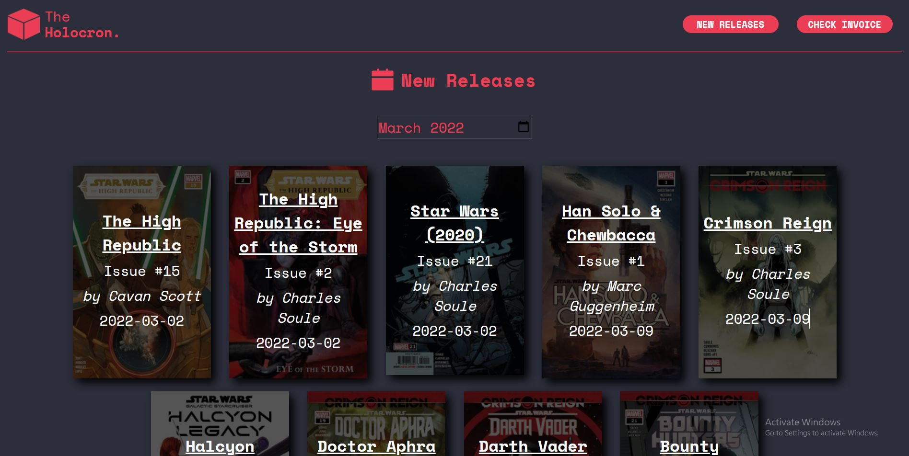
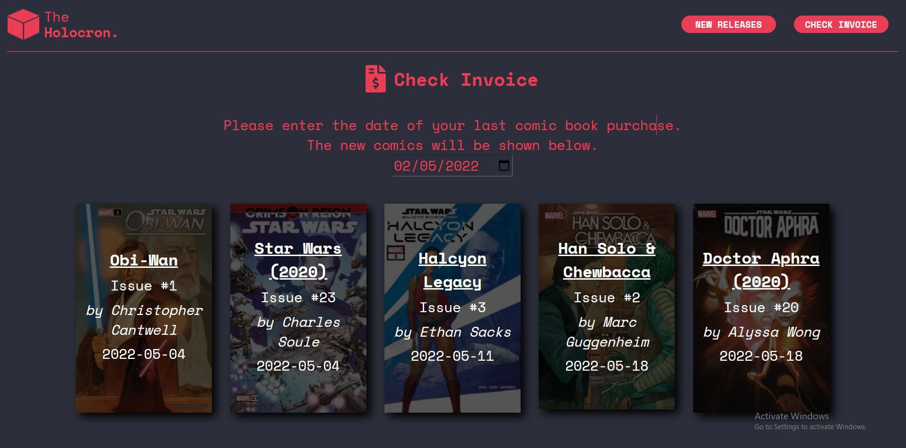

# The Holocron

*Note: The Holocron currently only supports Chrome browser. Other browser support is currently in development.*

### **What is The Holocron?**
---

The Holocron is a web application that shows the user the latest Star Wars comic releases. It also allows the user to check which comics they need to catch up on based on the date that the user last bought and/or read a Star Wars comic. 

You can access The Holocron [at this link](http://34.247.107.150:8080/).

### **How do I use The Holocron?**
---

### **1. New Releases**

The front page of The Holocron displays the comic releases for the current month. The user can change the month by clicking into the date selector and selecting the desired month. 

### **2. Check Invoice**

The user should select the date of their last comic book order, or the last time they caught up on Star Wars comics. Once the date is selected, the page will display all comics that have been released since that date.

### **How does The Holocron work?**
---
The web application periodically scrapes [this link on the Star Wars Fandom Wiki](https://starwars.fandom.com/wiki/Timeline_of_canon_media), and stores it in an internal database. The relevant information is displayed in accordance with the user's selection.

### **What technologies does The Holocron use?**
---

### **1. React**

The front end of the website was created with the help of the React library. This library was chosen because the core two features of the website needed to quickly update the web page based on a user's selection, which is something that React does very well. 

### **2. SpringBoot**

The back end of the website was created with the help of the SpringBoot framework. This framework was chosen because of the wealth of built-in features, such as as the Apache Tomcat server, database integration using JPA and front-end integration.

### **3. MariaDB**

My ultimate goal for this project was to be able to host this application on my Raspberry Pi, and to have it accessible on my home network. I already had MariaDB installed on my Raspberry Pi, and as such decided to use this database for this project. However, due to the fact that JPA is used throughout, the database can be easily swapped out by making the relevant edits in the "application.properties" file. 

### **4. JSoup**

JSoup was chosen to carry out web-scraping because its syntax was similar to that of BeautifulSoup, a Python library which I already had experience with.

**END**

